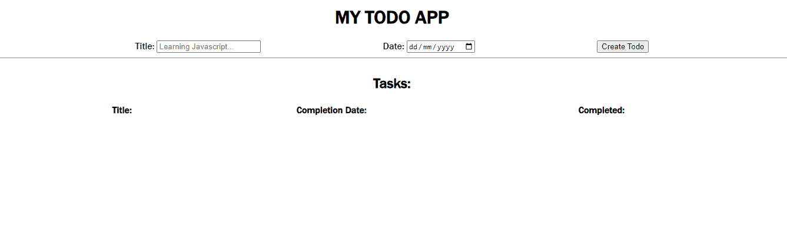

# TODO APP

A todo application written to demonstrate javascript in action.

## Description

This project involves an attempt to adhere to best practices in Javascript app development. The application persists todos to local Storage.

## Getting Started

### Dependencies
* There are no dependencies for this project. 
* You need to have a code editor

### Installing
* Clone this repository to your local development environment

### Executing program
* You can use the [liveserver](https://marketplace.visualstudio.com/items?itemName=ritwickdey.LiveServer) VSCode extension to run the code locally.

## Help
If you have a suggestion, consider adding it to [issues](https://github.com/vanheaven-ui/todo-app-erdhas/issues) tab in the repository.

## Authors

Ezekiel Mworekwa  
[Github](https://github.com/vanheaven-ui) |
[linkedIn](https://linkedin.com/vanheaven)

### You can leave a ⭐ on the repository if you like it.
